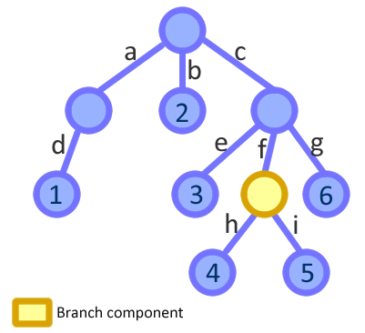
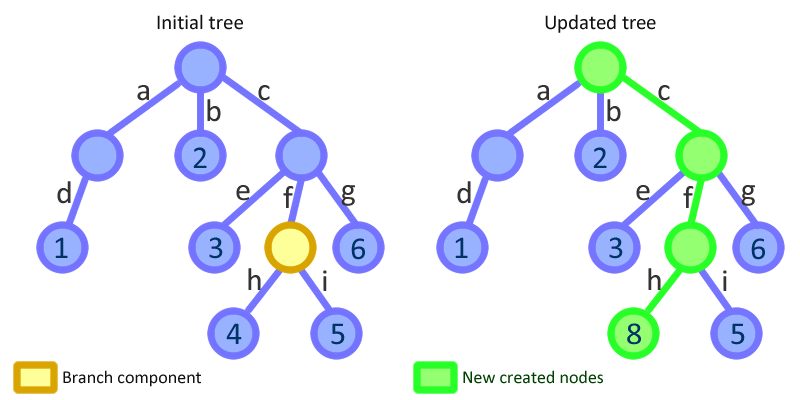

title: Immutable data and React
author: Babis Karypidis (xabikos)
description: An introduction on immutable data structures in JavaScript and how we can use these in React
date: <%= Date.today %>
% available themes: Default - Sky - Beige - Simple - Serif - Night - Moon - Solarized
theme: simple
% available transitions: // default/cube/page/concave/zoom/linear/fade/none
transition: linear
custom_css: presentation
% code-engine: coderay

!SLIDE
## Immutable data and React

&nbsp;

&nbsp;

An introduction to immutable data structures in JavaScript and their usage in React

&nbsp;

&nbsp;

&nbsp;

<a href="http://www.meetup.com/ReactJS-Belgium/">Brussels Reactjs meetup </a> 

&nbsp;

<a href="https://philos.io">Philos.io</a>

!SLIDE
## Who am I?

&nbsp;

<h3>
  Babis Karypidis (<strong>xabikos</strong>)
</h3>

&nbsp;

  Software Engineer

&nbsp;

  Freelance JavaSript and React developer for European Commission 

&nbsp;

  <a href="http://github.com/xabikos">github.com/xabikos</a>
   
  <a href="http://twitter.com/xabikos">twitter.com/xabikos</a>
   
  <a href="http://xabikos.com">xabikos.com</a>

!SLIDE
## Agenda

&nbsp;

* Immutable data structures in JavaScript
* Why to use Immutable data structures
* How can we benefit in React development

!SLIDE
## Available libraries

&nbsp;

* <a href="https://facebook.github.io/immutable-js/"> Immutable.js </a> by facebook 
* <a href="http://swannodette.github.io/mori/"> Mori </a>
* <a href="https://github.com/rtfeldman/seamless-immutable">seamless-immutable </a>
* <a href="https://gist.github.com/jlongster/bce43d9be633da55053f">A full list with additional helpers</a>

!SLIDE
## How it looks like - Creation

&nbsp;

The well known plain JS object
<% code do %>
let plainJSObject = {
  title: 'Immutablejs',
  creator: 'Facebook' 
};
<% end %>

&nbsp;

The equivalent immutable Map
<% code do %>
let immutalbeObject = Immutable.Map({
  title: 'Immutablejs',
  creator: 'Facebook' 
});
<% end %>

!SLIDE
## How it looks like - Mutation

&nbsp;

The well known plain JS object
<% code do %>
plainJSObject.title = 'another title';
plainJSObject.creator = 'another creator';
<% end %>

&nbsp;

The equivalent immutable Map
<% code do %>
let mutatedObject = immutableObject.set('title', 'another title');
let mutatedObjectAgain = mutatedObject.set('creator', 'antoher creator');
<% end %>

!SLIDE
## The reasons behind using Immutable data structures

&nbsp;

* Mutating state is evil
* No defensive copying
* Thread safety (not in JavaScript's single thread world)
* Undo and redo
* And a last one... Performance (mainly in React)

!SLIDE
## Mutating state

&nbsp;

Are we sure that after method invocation the array will remain the same?
<% code do %>
import { doSomeOperation } from 'myCoolLibrary';

let meetupMembers = ['davy', 'max', 'babis'];
doSomeOperation(meetupMembers);
<% end %>

!SLIDE
## Mutating state - the evil part

&nbsp;

A dummy but not too far from real code implementation
<% code do %>
export const doSomeOperation = (arr) => {
  while(arr.length > 0) {
    arr.pop();
  }
};
<% end %>

!SLIDE
## No defensive copy

&nbsp;

* Kinda related to the previous example. 
* A very popular approach is to copy some data when calling a method that we are not sure if it will mutate the data

!SLIDE
## Undo - Redo

&nbsp;

No more slides show us some code...
<a href="https://jsbin.com/wawuge/edit?js,output">Undo demo</a>

!SLIDE
## Performance

&nbsp;

Could the performance be improved with all these new onjects?

&nbsp;

* <a href="https://en.wikipedia.org/wiki/Persistent_data_structure">Structural sharing is the key</a>

&nbsp;

<a href="https://www.youtube.com/watch?v=I7IdS-PbEgI&list=PLb0IAmt7-GS1cbw4qonlQztYV1TAW0sCr&index=13">React.js Conf 2015 - Immutable Data and React (A must watch video)</a>

!SLIDE
## Performance

&nbsp;

The initial tree

&nbsp;

!SLIDE
## Performance

&nbsp;

The mutated tree

&nbsp;

!SLIDE
## Example in React

&nbsp;

Enough with the slides! Show us how can we use it...
<a href="https://jsbin.com/sefule/edit?html,js,console,output">React demo</a>

!SLIDE
## Example in React and Immutable

&nbsp;

Enough with the slides! Show us how can we use it...
<a href="https://jsbin.com/xaperu/edit?js,console,output">React demo with immutable</a>

!SLIDE
## Thank you for your patience